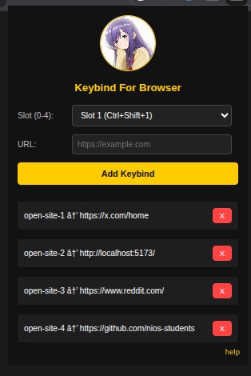

# Multi Keybind Site Opener!    

This is a simple local Chrome-based extension that allows you to open your most common websites with a keybind. You can assign up to four keybind slots and quickly open your favorite sites using keyboard shortcuts.

## Features
- Assign a **custom keybind** to open a specific website.
- **Four slots** available (Ctrl+Shift+1 to Ctrl+Shift+4).
- Simple and **lightweight** design.
- Stores keybinds locally using Chrome's storage.

## How It Works
1. Open the extension popup by clicking on the extension icon.
2. Enter the URL of the website you want to assign to a keybind.
3. Select a slot (1 to 4) for the keybind.
4. Click **Add Keybind**.
5. Now, you can press `Ctrl+Shift+1` to open the site assigned to **Slot 1**, `Ctrl+Shift+2` for **Slot 2**, and so on.

## Installation
1. **Download or clone** the extension files.

   ```sh
   git clone https://github.com/111-vk/Keybind-Manager-For-Browser.git
   ```
2. Open Chrome and navigate to `chrome://extensions/`.
3. Enable **Developer Mode** (toggle in the top right corner).
4. Click **Load unpacked** and select the extension folder.
5. The extension is now installed!

## Default Keybinds
| Slot | Keybind | Action |
|------|--------|--------|
| 1 | Ctrl+Shift+1 | Open assigned website for Slot 1 |
| 2 | Ctrl+Shift+2 | Open assigned website for Slot 2 |
| 3 | Ctrl+Shift+3 | Open assigned website for Slot 3 |
| 4 | Ctrl+Shift+4 | Open assigned website for Slot 4 |

> **Note:**
> 
> Sometimes these default keybinds are not automatically assigned in your browser's extension shortcuts. If pressing `Ctrl+Shift+1` to `Ctrl+Shift+4` does not open your assigned websites, you will need to manually assign these shortcuts.

### How to Manually Assign Keybinds

1. **Open your browser's extensions page:**  
   - Chrome: `chrome://extensions/`  
   - Brave: `brave://extensions/`
2. **Enable Developer Mode** if required.
3. **Click on Keyboard shortcuts:**  
   - Usually found in the top left (below your extensions) or in the top right corner.
4. **Locate the "Multi Keybind Site Opener" extension** in the list.
5. **Assign shortcuts for each slot:**  
   - Click the **pencil icon** next to the slot (e.g., "Open assigned website for Slot 1").  
   - The input field will activate. Enter your preferred keybind (e.g., `Ctrl+Shift+1` or `Ctrl+Shift+Y` for YouTube).
6. **Repeat** for all slots you want to use.
7. **Save your changes.**

This ensures your shortcuts are active and will work as expected.

> **Tip:**
> - Make sure the keybinds you enter do **not conflict** with any existing shortcuts in your browser or other extensions.
> - **Example:** Do not enter `Ctrl+H` as it is already assigned to the browser's history page. Check your browser's shortcut list for conflicts before assigning.

## Customizing Keybinds
If you don't like the default keybinds, you can change them by following these steps:
1. Open `brave://extensions/` in your browser.
2. Click on **Keyboard shortcuts** in the top left corner.
3. Find this extension in the list.
4. Click the **pencil icon** next to the shortcut you want to change.
5. Enter your preferred keybind and save it.

**Note:** Make sure the keybinds you enter do not conflict with any existing shortcuts in your browser or other extensions.

## Why No Custom Keybinds?
i don't want do that. or i don't know how to do that???

## Notes
- The extension currently supports only **four keybind slots**.
- Websites must be entered in full format (e.g., `https://www.youtube.com`).
- This is a **work in progress**; more features may be added later.

## Issues
If you encounter any issues, feel free to contribute or report an issue on GitHub.

## Preview

<div align="center">



</div>

---
🚀 **Enjoy quick access to your favorite sites with just a keystroke!**

---
